# Telemetry Overview

!!! info "Status — public-experimental"
    Introduced in `@vauban-org/agent-sdk@1.3.0` (ADR-ECO-039). Interface
    stable, additional event fields may be added before 2.0.

The agent-sdk exposes a **port-based telemetry pipeline** : agents emit
lifecycle events (`start` → `step…` → `finish`) and configurable **sinks**
decide where those events go. Sovereignty is preserved by default — no
network calls happen unless you explicitly opt in.

## Why a port + sinks pattern ?

Before v1.3, the SDK had an implicit DB coupling (`AgentRunTracker.start`
INSERTed directly into a Command Center–specific `agent_run` table). That
violated three invariants : sovereignty (SDK unusable without the CC DB),
boundary discipline (SDK knowing CC schema), and standalone-product
design (CC should be an optional consumer).

The port pattern fixes all three. See the design rationale in
[ADR-ECO-039](https://github.com/vauban-org/vauban-gouvernance/blob/main/governance/decisions/ADR-ECO-039-sdk-telemetry-port.md).

## Three usage modes

```mermaid
graph TD
  A[OODA loop runCycle&#40;&#41;] -->|TelemetrySink| B[TelemetryBus]
  B --> S1[stdoutTelemetrySink]
  B --> S2[localSqliteTelemetrySink]
  B --> S3[otlpTelemetrySink]
  B --> S4["commandCenterTelemetrySink<br/>(separate npm pkg)"]

  S1 -.-> O1[stderr / pino-pretty]
  S2 -.-> O2["~/.vauban/runs.db"]
  S3 -.-> O3["Langfuse / Tempo / Jaeger"]
  S4 -.-> O4["command.vauban.tech<br/>or self-hosted CC"]
```



### Mode 1 — Standalone (sovereign default)

Zero phone-home. Zero account required. Runs everywhere.

```ts
import {
  createOODAAgent,
  createTelemetryBus,
  stdoutTelemetrySink,
  localSqliteTelemetrySink,
} from "@vauban-org/agent-sdk";

createOODAAgent({
  agentId: "my-agent",
  /* …other config… */
  telemetry: createTelemetryBus({
    sinks: [
      stdoutTelemetrySink(),
      localSqliteTelemetrySink(),     // ~/.vauban/runs.db by default
    ],
  }),
});
```

Inspect locally via `sqlite3` or the upcoming `vauban-agent runs list` CLI.

### Mode 2 — Free Vauban CC SaaS

Adds remote backup + a hosted dashboard at `command.vauban.tech`.

```bash
pnpm add @vauban-org/cc-telemetry
```

```ts
import {
  createOODAAgent,
  createTelemetryBus,
  localSqliteTelemetrySink,
} from "@vauban-org/agent-sdk";
import { commandCenterTelemetrySink } from "@vauban-org/cc-telemetry";

createOODAAgent({
  agentId: "my-agent",
  telemetry: createTelemetryBus({
    sinks: [
      localSqliteTelemetrySink(),                                    // sovereign mirror
      commandCenterTelemetrySink({ apiKey: process.env.VAUBAN_API_KEY! }),
    ],
  }),
});
```

Free tier policy : **1 000 runs / month + 7 day retention** (see
[ADR-ECO-039 §3](https://github.com/vauban-org/vauban-gouvernance/blob/main/governance/decisions/ADR-ECO-039-sdk-telemetry-port.md)).
Sign up at [`command.vauban.tech`](https://command.vauban.tech).

### Mode 3 — Tiered (Team / Pro / Sovereign)

Same code as Mode 2. The API key prefix (`vauban_team_*` / `vauban_pro_*` /
`vauban_sovereign_*`) determines server-side entitlement. Pro tier signs
each run with a Vauban Claim Algebra attestation ; Sovereign runs in a
TDX/SEV-SNP enclave with L3 Madara anchoring. See
[sinks/cc.md](sinks/cc.md#tiers).

### Mode 4 — Self-hosted Command Center

Compatible with the AGPL CC backend (per [ADR-ECO-014](https://github.com/vauban-org/vauban-gouvernance/blob/main/governance/decisions/ADR-ECO-014-cc-oss-release.md)).

```ts
commandCenterTelemetrySink({
  apiKey: "internal",
  baseUrl: "https://cc.myorg.internal",
});
```

## Privacy guarantees

| # | Guarantee | Enforced by |
|---|---|---|
| 1 | Zero phone-home by default | No sinks configured = no network |
| 2 | Local sink always available | `localSqliteTelemetrySink` ships with SDK |
| 3 | PII never crosses sinks | `metadata` hashed unless `includePayloads: true` |
| 4 | Tenant isolation | RLS in CC backend, scoped Bearer keys |
| 5 | Audit log of active sinks | `vauban-agent telemetry status` (upcoming) |
| 6 | Sink failures never block agent | TelemetryBus isolates per-sink failures |

## Failure modes & guarantees

- **One sink crashes** → others continue. The agent loop is never blocked.
- **Network sink unreachable** → events queue locally up to `maxQueueDepth`
  (default 1000), then drop-oldest with a Prometheus-friendly counter.
- **OOM / heap exceeded** → no retry storm ; the agent enters `skipped`
  state with a `stopReason: "heap_exceeded:Xmb"` that surfaces in every
  sink.
- **CC backend down** → SDK auto-retries 5xx with exponential backoff +
  jitter. 4xx (auth, quota) are NOT retried (would only burn quota).

## Where it sits relative to Langfuse

Both coexist by design :

| Layer | What | Tool |
|---|---|---|
| Token-level | Per LLM call, latency, tokens, cost | Langfuse self-host |
| **Run-level** | **Per OODA cycle, status, outcome** | **TelemetryPort (this module)** |
| Outcome-level | Business value, HITL, proof | CC `outcome` table + L3 anchor |

## Next steps

- [stdout sink](sinks/stdout.md) — dev visibility
- [SQLite sink](sinks/sqlite.md) — sovereign local mirror
- [OTLP sink](sinks/otlp.md) — push to any OpenTelemetry receiver
- [CC sink](sinks/cc.md) — Vauban Command Center (free → sovereign)
- [Privacy & spotlighting](privacy.md)
- [Migration 1.2 → 1.3](migration.md)
